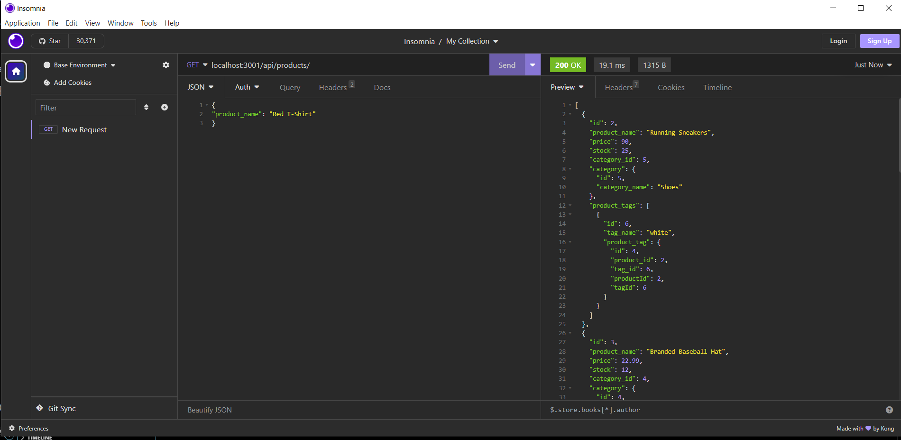

# 

# ORM-E-Commerce-Back-End

## [Patrick Lowe](https://github.com/PatrickWLowe)

## Description

#### An E-Commerce backend using MySQL2

## Technologies-Used


### dotenv

### GitBash

## Installation

#### You will need clone the repository and open the folder locally. Then you will need to run "npm install" in the parent folder. Then you will need to run "npm run seed" Then "npm start" to get the application working. Make GET, PUT, POST, DELETE requests using Insomnia or something simmiliar

## Acceptance Criteria

```md
GIVEN a functional Express.js API
WHEN I add my database name, MySQL username, and MySQL password to an environment variable file
THEN I am able to connect to a database using Sequelize
WHEN I enter schema and seed commands
THEN a development database is created and is seeded with test data
WHEN I enter the command to invoke the application
THEN my server is started and the Sequelize models are synced to the MySQL database
WHEN I open API GET routes in Insomnia for categories, products, or tags
THEN the data for each of these routes is displayed in a formatted JSON
WHEN I test API POST, PUT, and DELETE routes in Insomnia
THEN I am able to successfully create, update, and delete data in my database
```

## License

## This project is licensed under the MIT License

[MIT](https://opensource.org/licenses/MIT)

## Screenshots of the APP



## Video Walkthrough

### [Walkthrough](https://drive.google.com/file/d/1lbEBUkZM-9l1PLuSppNQagTmp23WPF_p/view)
